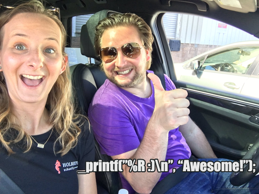

# 0x11. C - printf

## An ALX team project written by Happy Felix Chukwuma and Adioz Daniel

😇😇😇

## Tasks



### 0. I'm not going anywhere. You can print that wherever you want to. I'm here and I'm a Spur for life

This is a function that produces output according to a format.

* Prototype: ```int _printf(const char *format, ...);```
* Returns: the number of characters printed (excluding the null byte used to end output to strings)
* write output to stdout, the standard output stream
* ```format``` is a character string. The format string is composed of zero or more directives. See  ```man 3 printf``` for more detail.
* The following conversion specifiers are handled in this task:
  * ```c``` Prototype: ```int print_char(va_list ap, params_t *params);```
  * ```s``` Prototype: ```int print_string(va_list ap, params_t *params);```
  * ```%``` Prototype: ```int print_percent(va_list ap, params_t *params);```
* The buffer handling of the C library printf function is not reproduced at this stage
* The flag characters are not handled at this stage
* The field width is not handled at this stage
* Precision is not handled at this stage
* Length is not handled at this stage

### 1. Education is when you read the fine print. Experience is what you get if you don't

This is a function that produces output according to a specified format.

* Prototype: ```int _printf(const char *format, ...);```
* Returns: the number of characters printed
* write output to stdout, the standard output stream
* ```format``` is a character string. The format string is composed of zero or more directives. See  ```man 3 printf``` for more detail.
* The following conversion specifiers are handled in this task:
  * ```d``` Prototype: ```int print_int(va_list ap, params_t *params);```
  * ```i``` Prototype: ```int print_int(va_list ap, params_t *params);```

### 2. With a face like mine, I do better in print

This function handles the specified format:

* Prototype: ```int print_binary(va_list ap, params_t *params);```
* Returns: the formatted unsigned decimal output
  * ```b:``` the unsigned int is converted to binary

### 3. What one has not experienced, one will never understand in print

* This function handles the specified format below:
  * ```u``` Prototype: ```int print_unsigned(va_list ap, params_t *params);```
  * ```o``` Prototype: ```int print_octal(va_list ap, params_t *params);```
  * ```x``` Prototype: ```int print_hex(va_list ap, params_t *params);```
  * ```X``` Prototype: ```int print_HEX(va_list ap, params_t *params);```
* Returns: the formatted specifier output

### 4. Nothing in fine print is ever good news

This Use a local buffer of 1024 chars in order to call ```write``` as little as possible.
Added in ```main.h``` as ```#define WRITE_BUF_SIZE 1024```

### 5. My weakness is wearing too much leopard print

* This handles the following specifier
  * ```S``` : prints the string. Prototype: ```int print_S(va_list ap, params_t *params);```

### 6. How is the world ruled and led to war? Diplomats lie to journalists and believe these lies when they see them in print

This function handles the specified format below:

* ```p``` Prototype: ```int print_address(va_list ap, params_t *params);```

### 7. The big print gives and the small print takes away

* This function handles the following flag characters for non-custom conversion specifiers
  * Prototype: ```int get_flag(char *s, params_t *params);```
  * ```+```
  * ```space```
  * ```#```

### 8. Sarcasm is lost in print

* This function handles the following length modifiers
  * Prototype: ```int get_modifier(char *s, params_t *params);```
  * ```l```
  * ```h```

### 9. Print some money and give it to us for the rain forests

* This function handles width for non-custom conversion specifier
  * Prototype: ```char *get_width(char *s, params_t *params, va_list ap);```

### 10. The negative is the equivalent of the composer's score, and the print the performance

* This function handles precision for non-custom conversion specifiers
  * Prototype: ```char *get_precision(char *s, params_t *params, va_list ap);```

### 11. It's depressing when you're still around and your albums are out of print

* This function handles the ```0``` flag character for non-custom conversion specifiers
  * ```0``` : Prototype: ```int get_flag(char *s, params_t *params);```

### 12. Every time that I wanted to give up, if I saw an interesting textile, print what ever, suddenly I would see a collection

* This function handles the ```-``` flag character for non-custom conversion specifiers
  * ```-``` : Prototype: ```int get_flag(char *s, params_t *params);```

### 13. Print is the sharpest and the strongest weapon of our party

* This function prints the string in reverse
  * ```r```: Prototype: ```int print_rev(va_list ap, params_t *params);```

### 14. The flood of print has turned reading into a process of gulping rather than savoring

* This function converts and prints the string in rot13'ed format
  * ```R```: Prototype: ```int print_rot13(va_list ap, params_t *params);```

## Copyright protected (c) 2023

* Though this is a public repo, All rights are reserved
* This software is the property of the two contributors and is protected by copyright laws.
* Thus, Unauthorized reproduction or distribution of this software, or any portion of it, may result to:
  * Severe civil and criminal penalties.
  * Prosecution to the maximum extent possible under the law.
* This software is a sole effort of the two contributors for educational purposes only.
* It does not constitute any works from any other contributor(s) or author(s).

### Disclaimer

* This software can only be manipulated or checked, otherwise reviewed by **Alx Team**
**Thank you for finding interest to check out our awesome project**
